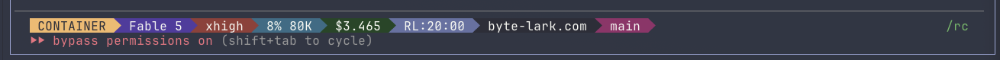
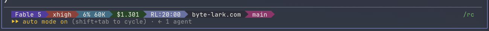

こんにちは。[前編](/blog/claude-code-devcontainer)では、Claude Codeをdevcontainerで隔離して全権限で自走させる環境を構築した話を書きました。  
今回はその続きで、実際に使い始めてから出てきた不便を解消した話です。

devcontainerで隔離そのものは問題なく動きましたが、いざ使ってみると細かい不便が出てきました。  
以下に気になった点と、どのように解消したかを記載します。

## コンテナの中のClaudeだけ、URLがリンクにならない

最初に気になったのはこれです。  
手元のMacのClaude Codeは出力中のURLがクリックできるリンクになるのに、コンテナ内のClaudeだけ素のテキストのままです。  
URLを開くたびにコピペするのは地味に面倒でした。

AIに調べてもらうと、原因は環境変数でした。  
Claude Codeは、出力するURLをリンクにするかどうかを、ターミナルがリンク表示（OSC 8という仕組み）に対応しているかで決めています。  
対応していればURLをリンク用の制御コードで包んで出力し、非対応なら素のテキストのまま出します。  
その判定に使っているのが環境変数です。  
`FORCE_HYPERLINK`があればその値に従い、無ければ`TERM_PROGRAM`（ターミナルアプリの名前が入る変数）などから端末の種類を調べて、対応しているかを決めます。  
ところが、コンテナに入るときに使う`devcontainer exec`は、Macの環境変数をコンテナに渡しません。  
コンテナ中には`TERM_PROGRAM`が無いので、「どの端末か分からない＝リンク非対応」と判定されていました。

`FORCE_HYPERLINK`があればそれに従うのなら、これをコンテナに渡せば済みます。  
まずは次のコマンドを手で1回打って、リンクが出ることを確かめました。

```bash
devcontainer exec --workspace-folder . \
  --remote-env FORCE_HYPERLINK=1 \
  claude
```

`--remote-env`はコンテナの中のコマンドに環境変数を渡すオプションで、`FORCE_HYPERLINK=1`は「端末の判定に関係なくリンクを出す」という指定です。  
これでリンクが出るようになりました。  
普段は、コンテナの起動からこの`devcontainer exec`までをまとめた自作コマンド`ccd`でClaudeに入っているので、`ccd`の中の`devcontainer exec`にも同じ`--remote-env FORCE_HYPERLINK=1`を足しました。

## スクリーンショットが渡せない

Claude Codeでは、クリップボードの画像をそのまま貼り付けて「このスクショのここが崩れてる」と相談できますが、コンテナ内ではこれができませんでした。  
スクショは[CleanShot X](https://cleanshot.com/)というツールで撮っています。  
Claude Codeに画像を渡す方法は、[公式ドキュメント](https://code.claude.com/docs/en/common-workflows#work-with-images)に3つ書かれています。  
ウィンドウへのドラッグ＆ドロップ、`Ctrl+V`での貼り付け、入力に画像ファイルのパスを書く、の3つです。  
Macでスクショを貼り付けていたのは、実質この3つ目でした。  
撮ったスクショを貼り付けると、入力に入るのは画像そのものではなくMac上の画像ファイルのパス（`/Users/.../CleanShot 2026-08-09 at 12.45.21.png`のような文字列）で、Claude Codeがそのパスのファイルを読んで画像として扱います。  
コンテナの中のClaude Codeにも同じパスの文字列は入りますが、そのパスはコンテナには存在しないので読めない、という状況でした。

最初は手作業で対応していました。  
スクショを撮ったら、リポジトリ内のgitignoreされたディレクトリ`.playwright-mcp/`（Playwrightが出力用に使っている場所の間借り）へ画像をコピーし、Claudeには「`.playwright-mcp/github.png`を見て」とパスを打って読ませる、という手順です。  
ただ、毎回「スクショを撮る → ディレクトリに格納 → パスコピーしてをClaudeに貼る」という作業が面倒なので別の方法を検討しました。  

まずはクラウド経由での画像共有です。  
CleanShot Xは、買い切りのBasicプランでも1GBのクラウドストレージが付いてきます。  
アップロードと同時にクラウド上の画像URLがクリップボードに入るので、そのURLを貼ってコンテナ側でダウンロードして開けばよいのでは、と考えました。

ただこれは前編で書いたfirewallの方式とぶつかりました。  
クラウド上の画像URLのホスト名を調べると、調査時点ではCDN（AWSのCloudFront）から配信されていました。  
一方このfirewallは、コンテナの起動時にドメイン名をIPに変換して、そのIPだけを通す方式です。  
CDNは一般に名前解決で返ってくるIPが固定とは限らず、変わることがあります。CleanShotの配信先も変わる可能性があり、変わるとfirewallを通らなくなって画像を取得できず、その都度コンテナの再起動が必要になると考え、この方法も却下しました。

最終的には、CleanShotの保存先ディレクトリを、読み取り専用でコンテナにマウントする形にしました。

```json
{
  "source": "${localEnv:HOME}/Library/Application Support/CleanShot/media",
  "target": "${localEnv:HOME}/Library/Application Support/CleanShot/media",
  "type": "bind",
  "readonly": true
}
```

マウント先（target）はMacとまったく同じパスにしています。  
貼り付けで入力されるMac上のパスがコンテナの中でもそのまま読めるので、ファイルをコピーする必要もありません。撮って貼るだけで済みます。

ただし、その引き換えに撮影履歴のディレクトリ全体がコンテナから見えるようになります。  
ここは迷いましたが、読み取り専用で書き込みも削除もできないこと、firewallに穴を空ける必要もないことから、この方法を採用しました。

## どちらのClaudeか見分けがつかない

Macと同じ設定をコンテナに持ち込んでいる（前編の「持ち込みはコピー」方式）ので、画面下部のステータス表示も同じです。  
つまり、開いているタブがMac上のClaudeなのか、コンテナ上のClaudeなのか、見た目では区別がつきません。

対処として、コンテナの中でだけ、ステータス表示の先頭に「CONTAINER」という目印（バッジ）を出すことにしました。

```bash
if [ -f /.dockerenv ] || [ "${DEVCONTAINER:-}" = "true" ]; then
  seg "$C_ORANGE" "$FG_ONORANGE" " CONTAINER "
fi
```

条件に使っている`/.dockerenv`はコンテナの中にだけあるファイル、`DEVCONTAINER`はイメージを作るときに仕込んだ環境変数で、どちらかがあればコンテナの中と見なしています。

`seg`は、AIを使って自作したステータス表示のシェルスクリプト中の関数で、背景色・文字色・テキストを受け取って色付きの項目を1つ描きます。  
ステータス表示の全体は、モデル名やコストなどの項目をこの`seg`で並べて作っています。

```bash
prev_bg=""
seg() {
  if [ -n "$prev_bg" ]; then
    printf "\033[38;2;%sm\033[48;2;%sm%s\033[0m" "$prev_bg" "$1" "$SEP"
  fi
  printf "\033[48;2;%sm\033[38;2;%sm%s\033[0m" "$1" "$2" "$3"
  prev_bg="$1"
}
```

バッジの色は、ほかの項目が暗めの色地に白文字で統一されているのに対して、明るいオレンジ地に黒文字と明暗を反転させて、気づきやすくしました。

実際の表示はこうなります。コンテナのセッションだけ先頭にバッジが付き、Macのセッションはこれまでどおりです。

### コンテナ上の表示


### Mac上の表示


### シェルを修正したのに反映されない

このバッジを作っている最中に、もうひとつ気づいたことがあります。  
Macでシェルスクリプトを直したのに、コンテナの表示に反映されないんです。

こちらもAIを使って確認したところ、持ち込みの仕組みに原因がありました。

- 設定をコンテナへコピーする処理が走るのは、コンテナの作成時と起動時だけ
- 普段の起動コマンド`ccd`がやるのは「動いているコンテナに新しいセッションで入る」ことで、コンテナを起動し直さない

という仕様だったため、修正を反映するには、コンテナを再起動する必要がありました。  
Mac本体の設定を壊すリスクを回避するためにコピー方式にしましたが、リアルタイム反映されないデメリットもあります。

この改善を行う中で、起動済みコンテナにシェルで入るだけの`ccdsh`と、コンテナを停止する`ccds`というコマンドも追加しました。  
コンテナ設定修正の度に再起動が発生することと、調査でコンテナの中を直接確認したい場面も何度もあったからです。  
こういう都度の操作は、覚えやすい短いコマンドにしておくと日々のメンテが楽になります。

## スマホからコンテナ内のセッションが見えない

Claude CodeにはRemote Controlという機能があり、動いているセッションをスマホアプリやWeb版の一覧から開いて、状況確認や指示を行うことができます。  
Claudeを自走させる際に相性の良い機能なのですが、Macのセッションは一覧に出るのに、コンテナ内のセッションだけ出ませんでした。

原因は設定の持ち込み方でした。

- Macからコンテナへコピーしているのは、CLAUDE.md・ステータス表示のシェルスクリプト・出力スタイルの3つ
- settings.jsonはコピーせず、コンテナ専用の最小限のものを別に用意している
- Macのsettings.jsonにはRemote Controlを自動で接続する設定が入っているが、コンテナ専用のものには入っていなかった

対処は、コンテナ専用のsettings.jsonに同じ1行を足すだけです。

```json
"remoteControlAtStartup": true
```

ただし、settings.jsonは「コンテナ内に無いときだけコピーする」作りにしています。コンテナの中で調整した設定を、起動のたびに上書きしないためです。  
そのため足した1行が効くのは新しく作るコンテナだけで、動いていた既存のコンテナでは、中のClaudeの設定画面（`/config`）から直接有効にしました。  
これでコンテナ内のセッションも一覧に出るようになり、スマホで作業指示ができるようになりました。

## ビルドは成功したのに、claudeが入っていない

この環境一式は雛形にして、別のプロジェクトでも同じ構成のコンテナを使い回しています。  
その新しいプロジェクトで、初回のイメージビルドは成功したのに、起動すると次のエラーになりました。

```text
OCI runtime exec failed: exec failed: unable to start container process: exec: "claude": executable file not found in $PATH
```

コンテナの中に入って`which claude`を打っても`claude not found`でした。

調べたところ、イメージの中のclaudeは500バイトのダミーファイルになっていました。  
npmで配布されるClaude Codeは、次のような作りになっているようです。

- `npm install`でまず置き場所にダミーファイルを置く
- 本体のネイティブバイナリは、OS・CPU別のoptionalDependenciesとして別パッケージで取ってくる
- インストール後の処理で、ダミーを本体で上書きする

このビルドでは本体のパッケージの取得が失敗していて、ダミーが残ったままでした。  
npmの仕様では、optionalDependenciesの取得に失敗してもインストール全体は失敗になりません。  
そのため、本体が入っていなくてもビルドは成功扱いになっていました。取得がなぜ失敗したのかは、結局分かっていません。

対処はDockerfileの1行です。インストールの直後に、claudeを実際に1回実行する行を足しました。

```dockerfile
RUN npm install -g @anthropic-ai/claude-code@${CLAUDE_CODE_VERSION} \
  && claude --version
```

claudeが壊れていればこの行でビルドが失敗するので、claudeのインストール失敗をビルドの失敗として検知できます。  
ダミーファイル自体は存在するので、ファイルの有無を見る確認では検知できません。実際に実行して確かめるのがポイントです。  
この1行は雛形にも入れました。

## まとめ

- コンテナ内だけURLがリンクにならないのは、`devcontainer exec`がMacの環境変数を渡さないため。`--remote-env FORCE_HYPERLINK=1`で解決
- スクショはfirewallに穴を空けず、保存先ディレクトリをMacと同じパスへ読み取り専用でマウント。貼り付けたパスがそのまま通る
- Macとコンテナの取り違え防止に、コンテナの中だけステータス表示にCONTAINERバッジを出す
- コンテナ内のセッションがスマホやWeb版の一覧に出ないのは、コンテナ専用のsettings.jsonにRemote Controlの自動接続が無かったため。`remoteControlAtStartup: true`を1行追加
- イメージのビルドが成功してもclaudeが壊れていることがある。npmがoptionalDependencies（本体のネイティブバイナリ）の取得失敗を無視するため。`claude --version`をビルドに足して検知

URL・スクショ・Remote Controlの3つは、Macでは意識していなかったものが、隔離したことでコンテナに届かなくなった、という副作用でした。  
環境変数や設定はコンテナに渡し、スクショはマウントで別の道を用意する、という形で一つずつ解消しました。  
バッジは環境が2つになったことで新しく必要になったもので、ビルドの1件は雛形を使い回して初めて出てきたものです。  
どれも解消するたびに確実に快適になり、いまはMacで直接起動するのではなく、コンテナの中で全権限のClaudeを動かす使い方が標準になっています。  
コンテナの中のClaude Codeに同じような不便を感じている人は、ぜひ解消を試してみてください。この記事がその役に立てば嬉しいです。
