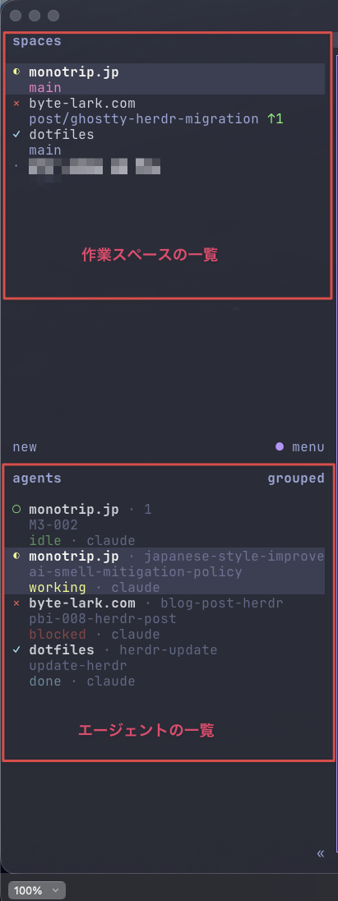
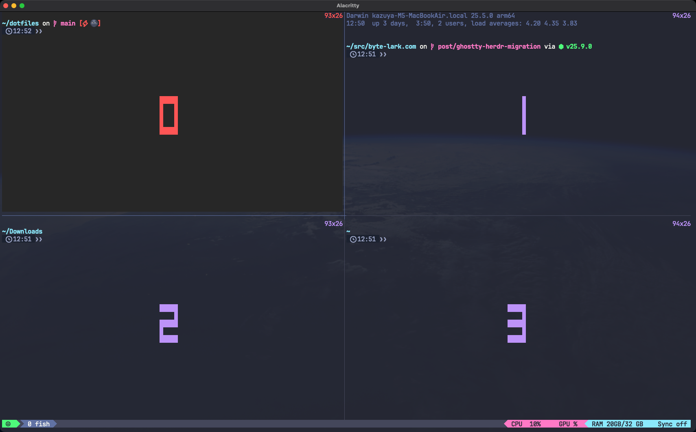

こんにちは。今回はターミナル環境を乗り換えた話です。  
これまでalacritty + tmuxは2年半ほど使っていましたが、ここ2ヶ月ほどghostty + herdrを使っています。

この記事では以下を紹介します。  
※ターミナルマルチプレクサ自体の説明はしません
- Claude Codeを複数走らせる作業がどう変わったか
- 日本語入力のハマりどころ2件
- いま使っている設定

## herdrとは

[herdr](https://herdr.dev/)は、Rust製のターミナルマルチプレクサで、ペインとタブ（tmuxのウインドウ相当）を持ちます。  
tmuxに無いのは左サイドバーで、spaces（作業スペースの一覧）とagents（動いているAIエージェントの一覧）が並びます。  
agentsの行には状態（working / blockedなど）が表示され、承認待ちや完了でmacOSの通知も出せます。  
一言でいうと、tmuxをAIエージェント向けに再構築したもの、というイメージかと思います。

実際のサイドバーはこうなっています。  
（作業スペースの一番下は業務のリポジトリのためモザイクを入れています）

  
*herdrのサイドバー*

手元のバージョンはherdr 0.9.0で、執筆時点の最新です。

インストールは公式のスクリプトか、Homebrewでできます。

```bash
curl -fsSL https://herdr.dev/install.sh | sh
# または
brew install herdr
```

## 導入のきっかけ

alacritty + tmuxに困っていたわけではないのですが、たまたま[herdrの紹介記事](https://zenn.dev/studypocket/articles/herdr-ai-agent-multiplexer)を見つけて読んでみたところ  
「これはtmuxのAIエージェント向け上位互換かも？」と思って試してみました。  
導入の決め手は、エージェントの状態を設定なしで可視化できるところと、キーバインドがtmux互換で学習コストが低そうなところでした。  
実際に入れてみると、tmuxでできること＋エージェントの状態の可視化や通知ができるため、「これはいいぞ！」となって定着しました。

ちなみにherdrのGitHubスターは、紹介記事の時点（2026年7月）では約9,800でした。  
この記事の執筆時点では38,000を超えていて、2ヶ月で4倍近くに増えています。

## 変わったこと

### 作業の型が決まった

herdrの[公式ドキュメント](https://herdr.dev/docs/concepts)には、workspace（サイドバーの表示ではspaces）について「Use one workspace per repo, task, or investigation.（workspaceはリポジトリ・タスク・調査ごとに1つ使う）」とあります。  
私はリポジトリごとにspaceを分け、その中でタスクごとにタブを作成し、1タスクに1エージェントを走らせています。  
一時的なコマンド実行やメモなどが必要な場合はタブ内を複数ペインに分割して行っています。  
普段の画面はこんな感じです。

  
*左がspacesとagentsのサイドバー、右がコマンド実行用のペイン*

tmux時代はエージェントの実行状態を把握したいが為に、1画面に多い時は4〜6ペインを開いていました。  
それでも1画面で収まらない場合は、複数ウインドウ×複数ペインでエージェントを起動していました。  
これが現在の型にしてからは主に1〜2ペイン、多くて3ペイン程度で足りています。

### エージェントの巡回がなくなった

tmuxでエージェントを複数走らせていたころは、ウインドウを順に切り替えて、終わったか・止まっていないかを見て回っていました。  
herdrではサイドバーのagentsに下のように状態が並ぶので、見て回る必要がなくなりました。  
これだけでも導入の価値があったと思います。

  
*agentsサイドバーの拡大*

### 通知で気づけるようになった

エージェントが入力や承認を待つ状態になったり、作業が終わったりすると、macOSの通知が来ます。  
こちらから見に行かなくてもよくなり、待ち時間に別の作業へ移りやすくなりました。  
届くのはこんなバナーです。

  
*作業完了を知らせるmacOSの通知*

herdrの設定ファイル（`~/.config/herdr/config.toml`）に次を書いて設定しています。  
配送先はOSの通知サービスのほか、herdr内のトーストや端末経由も選べるようです。

```toml
[ui.toast]
# エージェントが承認待ち・完了になったら macOS 通知
delivery = "system"
```

## 端末もalacrittyからghosttyへ

herdrの導入に、ターミナルを替える必要はありません。実際、最初はalacritty + herdrで試していました。

ghosttyに替えた理由は、コミットログにも残っておらず、自分でも覚えていないのですが、  
この記事を書くにあたって試し直したところ、alacrittyではエージェントの通知が音だけで、デスクトップ通知が出ませんでした。ghosttyだけを起動し直すと通知が届きます。  
ここはghosttyに乗り換えるメリットになると思います（おそらくこれが理由で乗り換えた）。

## 乗り換えて困ったこと

ほとんどありません。alacrittyは速さが売りですが、ghostty + herdrにして遅いと感じたこともないです。  
強いて挙げると2つあります。  
1つ目はcopy-modeの挙動です。  
tmuxのcopy-mode相当の画面は、0.7.3では`$`での行末ジャンプと`w`や`b`での単語移動の挙動がtmuxと違いました。  
（`$`で行末に飛ぼうとするとカーソルが画面の右端に飛ぶなど、結構不便でした）  
ただこの問題は、0.9.0に更新したところ解消しました。

2つ目は、tmuxのdisplay-panesに相当するものが無いことです。  
prefix+qで各ペインに大きな番号が表示され、番号キーを押すとそのペインへ移動できる機能です。  
tmuxではこんな表示になります。

  
*tmuxのdisplay-panes。番号キーでそのペインへ移動できる*

ただこちらも、先に書いた作業の型ができたことで、ペインの数自体が減り、無くても困らなくなりました。

## ハマりどころ2件（どちらも日本語入力）

乗り換え時にハマったことが2件あるので、以下に記載します。

### 日本語が打てなくなる

乗り換えたあと、ターミナルでだけ日本語が入力できなくなる事象が発生しました。

- 結構な頻度で発生する（1時間に数回発生）
- 日本語入力できなくなると、IMEを一度Offにし、再度Onにしても直接入力のままになる（OnにしたのにOff状態）
- 発生時は、ブラウザなど他のアプリケーションで日本語入力すると、ターミナルでも日本語が入力できるようになる

という謎な状態になるので、地味にストレスでした。

まずは切り分けのため、Mac標準のIME、azooKey、Google日本語入力など、複数のIMEを試しました。  
結果、どのIMEにしても発生するため、どうやらIMEの問題ではなさそうです。

次にAIを使って調査したところ、原因はherdrの実験的設定`switch_ascii_input_source_in_prefix`のようでした。  
prefixキーを使っている間だけ、入力ソースをASCIIに切り替える機能です。  
日本語IMEのままprefixを押して文字が化けるのを防いでくれるのですが、元の入力ソースに戻し損ねることがあるようです。  
（[herdr #1221](https://github.com/herdrdev/herdr/issues/1221)、最新0.9.0でも未修正）

この設定は既定では無効で、私はAIの提案を受けて有効にしていましたが、デメリットの方が大きいので無効にしました。

```toml
[experimental]
# prefix 操作中だけ macOS の入力ソースを ASCII に自動切替（日本語 IME の prefix 誤爆対策）。
# 元の入力ソースに戻し損ねて日本語入力できなくなる不具合（herdr #1221、0.9.0 で未修正）を
# 頻繁に踏むため無効化。修正が入ったら再検討する
switch_ascii_input_source_in_prefix = false
```

### 変換中にCtrl+Kを押すと入力が消える

もう1件は、herdrではなくghostty側でした。  
日本語の変換中にCtrl+KやCtrl+L、Ctrl+;を押すと、変換中の文字が消えます。  
最初はIME（azooKey）を疑いましたが、ghosttyの既知バグでした。  
修正は[PR #12547](https://github.com/ghostty-org/ghostty/pull/12547)でマージ済みですが、執筆時点の安定版1.3.xには入っていません。  
私はtip版（開発版）に切り替えて解消しました。  
tip版が知らないうちに更新されて挙動が変わらないよう、更新は通知だけにする`auto-update = check`も併せて設定しています。

## いま使っている設定

設定の実物から、記事で触れた部分を抜粋して載せておきます。

herdrのキーバインドは、tmuxで使っていた操作に合わせています。  
設定ファイルは`~/.config/herdr/config.toml`です。

```toml
[keys]
# tmux で使っていた prefix と同じ
prefix = "ctrl+a"
# tmux の bind C-d detach-client 相当（herdr デフォルトは prefix+q）
detach = "prefix+ctrl+d"
# tmux の prefix+{/}（swap-pane）を agent 切替に転用
previous_agent = "prefix+{"
next_agent = "prefix+}"
# alt+番号でサイドバーの agent 行 n 番目へ直接ジャンプ
focus_agent = "alt+1..9"
# tmux（pain-control）の prefix+| と同じ右分割。デフォルトの prefix+v を置き換え
split_vertical = "prefix+|"
# デフォルト（goto=g、picker=w）から入れ替え。w=window（navigator で tab/pane へジャンプ）、
# g=global（workspace 一覧）の覚え方
goto = "prefix+w"
workspace_picker = "prefix+g"
# 番号切替は space を主役に、tab は shift+番号（repo=space / agent=tab 運用）
switch_workspace = "prefix+1..9"
switch_tab = "prefix+shift+1..9"
# 作成系：c=space（tmux の c=new-window の手癖を space に引っ越し）、t=tab
new_workspace = "prefix+c"
new_tab = "prefix+t"
```

ghostty側は、起動コマンドをherdrにして、ghostty内蔵の分割・タブのキーを無効化しています。  
理由や補足は設定内のコメントに書いてあります。

```
# ------ Shell ------
# Launch herdr (attaches to the persistent session, creates it if missing)
# Fish is spawned by herdr itself via [terminal] default_shell in herdr/config.toml
command = /opt/homebrew/bin/herdr

# 手元では自動更新されて挙動が変わったため、通知のみに留める（off / check / download）
auto-update = check

# ------ Keybindings ------
# 分割・タブ操作は herdr（prefix+h/j/k/l、prefix+|、prefix+t など）に一本化したので
# ghostty 側では持たない。alt+... は ghostty で処理せず、pane 内のアプリ（nvim 等）にそのまま渡す
# （ghostty 既定の alt+←/→ = esc:b / esc:f だけは残る）

# ===== ghostty 内蔵の split / tab ショートカットを無効化 =====
# 押すと同じ herdr セッションに 2 つ目のクライアントがつながってしまうため。
# unbind は割り当てを外すだけで、キーはアプリに届く（ignore はキー入力を捨てる）
# split（super+d ほか）
keybind = super+d=unbind
keybind = super+shift+d=unbind
# tab（super+t、super+1..9、ctrl+tab ほか）
keybind = super+t=unbind
keybind = super+1=unbind
# （同様に split / tab 系のキーを合計 37 行 unbind）
```

## 今後試したいもの

まだまだ使いこなしているとはいえず、試せていない機能があるのですが、以下は順に試してみるつもりです。

- [agent skill](https://herdr.dev/docs/agent-skill/)：ペインの中のエージェントにherdrの操作方法を教える公式のスキルで、エージェント自身がherdrを操作できるようになります
- [マーケットプレイス](https://herdr.dev/plugins/)：コミュニティのプラグインを検索して導入できます

## まとめ

- tmuxでやっていたことはそのままに、エージェントの状態の可視化と通知ができるようになりました
- エージェントの巡回がなくなり、待ち時間は別の作業に充てられています
- 乗り換えて2ヶ月、予想以上に快適でherdrは必須になりました
- herdrはいいぞ！
