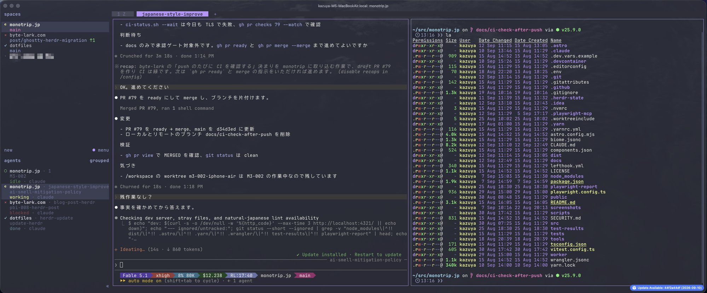
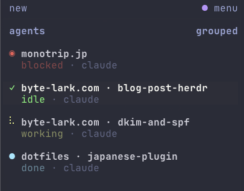
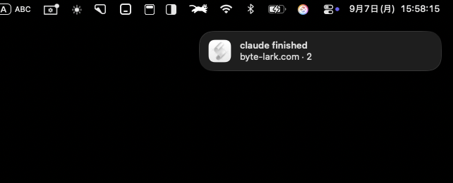

こんにちは。今回はターミナル環境をalacritty + tmuxからghostty + herdrへ乗り換えた話です。  
alacritty + tmuxは2年半ほど使っていましたが、ここ2ヶ月ほどghostty + herdrを使っています。

この記事では以下を紹介します。  
※ターミナルマルチプレクサ自体の説明はしません
- Claude Codeを複数走らせる作業がどう変わったか
- 日本語入力のハマりどころ2件
- いま使っている設定


## herdrとは

[herdr](https://herdr.dev/)は、Rust製のターミナルマルチプレクサで、tmuxのようにペインとタブを持ちます。  
tmuxに無いのは左サイドバーで、spaces（作業スペースの一覧）とagents（動いているAIエージェントの一覧）が並びます。  
agentsの行には状態（working / blockedなど）が表示され、承認待ちや完了でmacOSの通知も出せます。  
一言でいうと、tmuxをAIエージェント向けに再構築したもの、というイメージかと思います。

手元のバージョンはherdr 0.7.3です（執筆時点の最新は0.9.0）。

インストールは公式のスクリプトか、Homebrewでできます。

```bash
curl -fsSL https://herdr.dev/install.sh | sh
# または
brew install herdr
```

## 導入のきっかけ

alacritty + tmuxに困っていたわけではないのですが、たまたま[herdrの紹介記事](https://zenn.dev/studypocket/articles/herdr-ai-agent-multiplexer)を見つけて読んでみたところ  
「これはtmuxのAIエージェント向け上位互換かも？」と思って試してみました。  
導入の決め手は、エージェントの状態を設定なしで可視化できるところと、キーバインドがtmux互換で学習コストが低そうなところでした。  
実際に入れてみると、tmuxでできること＋エージェントの状態の可視化や通知ができるため、「これはいいぞ！」となって定着しました。

ちなみにherdrのGitHubスターは、紹介記事の時点（2026年7月）では約9,800でした。  
この記事の執筆時点では37,000を超えていて、2ヶ月で4倍近くに増えています。

## 変わったこと

### 作業の型が決まった

herdrの[公式ドキュメント](https://herdr.dev/docs/concepts)には、workspace（サイドバーの表示ではspaces）について「Use one workspace per repo, task, or investigation.（workspaceはリポジトリ・タスク・調査ごとに1つ使う）」とあります。  
私はリポジトリごとにspaceを分け、その中でタスクごとにタブを作成し、1タスクに1エージェントを走らせています。  
一時的なコマンド実行やメモなどが必要な場合はタブ内を複数ペインに分割して行っています。  
普段の画面はこんな感じです。

*左がspacesとagentsのサイドバー、右がコマンド実行用のペイン*

tmux時代はエージェントの実行状態を把握したいが為に、1画面に多い時は4〜6ペインを開いていました。  
それでも1画面で収まらない場合は、複数ウインドウ×複数ペインでエージェントを起動していました。
これが現在の型にしてからは主に1〜2ペイン、多くて3ペイン程度で足りています。  
なお、画像ではエージェントをdevcontainerで動かしていますが、これは[以前の記事](/blog/claude-code-devcontainer)に書いています。

### エージェントの巡回がなくなった

tmuxでエージェントを複数走らせていたころは、ウィンドウを順に切り替えて、終わったか・止まっていないかを見て回っていました。  
herdrではサイドバーのagentsに下のように状態が並ぶので、見て回る必要がなくなりました。  
これだけでも導入の価値があったと思います。

*agentsサイドバーの拡大*

### 通知で気づけるようになった

エージェントが入力や承認を待つ状態になったり、作業が終わったりすると、macOSの通知が来ます。  
こちらから見に行かなくてもよくなり、待ち時間に別の作業へ移りやすくなりました。  
届くのはこんなバナーです。

*作業完了を知らせるmacOSの通知*

設定は次のとおりです。  
配送先はOSの通知サービスのほか、herdr内のトーストや端末経由も選べます。

```toml
[ui.toast]
# エージェントが承認待ち・完了になったら macOS 通知
delivery = "system"
```

## 端末もalacrittyからghosttyへ

herdrの導入に、ターミナルを替える必要はありません。実際、最初はalacritty + herdrで試していました。  
dotfilesのコミットログでは、alacrittyの起動をherdrに切り替えたのが最初で、その約2週間後にghosttyでも同じ切り替えをしています。

ghosttyに替えた理由は、コミットログにも残っておらず、自分でも覚えていません。  
この記事を書くにあたって試し直したところ、alacrittyではエージェントの通知が音だけで、デスクトップ通知が出ませんでした。ghosttyだけを起動し直すと通知が届きます。  
仕組みの違いまでは追えていませんが、当時もこれに気づいて替えたのだろうと思います。  
いまの使い方は通知が前提なので、選び直すとしてもghosttyにします。

ghostty自体は過去にも一度試して、そのときはalacritty + tmuxに戻っています。  
ターミナルはiTerm2、wezterm、warpも使ってきました。  
iTerm2は完成度が高くて不満らしい不満は出ないのですが、設定がバイナリ形式で、gitでの管理がしっくりこず、何往復もしては離れています。  
warpは日本語変換に難があり、weztermはlua設定など良い点もあったのですが、どこがとは言えないまま合わず、どちらも定着しませんでした。  
herdrとの組み合わせになって、ようやくghosttyに落ち着きました。

## 乗り換えで失ったもの

ほとんどありません。alacrittyは速さが売りですが、ghostty + herdrにして遅いと感じたこともないです。  
強いて挙げると2つあります。  
tmuxのcopy-mode相当の画面で、`0`や`$`での行頭・行末ジャンプと`w`や`b`での単語移動の挙動が今ひとつです。  
それと、tmuxでペインに番号を出して選ぶ機能（display-panes）に相当するものがありません。  
ただ、先に書いた型でペインの数自体が減ったので、display-panesの方は困らなくなりました。

## ハマりどころ2件（どちらも日本語入力）

### 日本語が打てなくなる

乗り換えたあと、ターミナルでだけ日本語が打てなくなる現象に当たりました。  
IMEを日本語にしても直接入力のままで、他のアプリで一度日本語を打つと直ります。  
azooKey、Google日本語入力など、複数のIMEで試しても発生するため、IMEの問題ではなさそうです。

AIを使って調査したところ、原因はherdrの実験的設定`switch_ascii_input_source_in_prefix`のようでした。  
prefixキーを使っている間だけ、入力ソースをASCIIに切り替える機能です。日本語IMEのままprefixを押して文字が化けるのを防いでくれるのですが、元の入力ソースに戻し損ねることがあるようです（[herdr #1221](https://github.com/herdrdev/herdr/issues/1221)、最新0.9.0でも未修正）。  
私はこの設定をfalseにして解消しました。  

```toml
[experimental]
# prefix 操作中だけ macOS の入力ソースを ASCII に自動切替（日本語 IME の prefix 誤爆対策）。
# 元の入力ソースに戻し損ねて日本語入力できなくなる不具合（herdr #1221、0.7.3 で未修正）を
# 頻繁に踏むため無効化。修正が入ったら再検討する
switch_ascii_input_source_in_prefix = false
```

### 変換中にCtrl+Kを押すと入力が消える

もう1件は、herdrではなくghostty側でした。  
日本語の変換中にCtrl+KやCtrl+L、Ctrl+;を押すと、変換中の文字が消えます。  
最初はIME（azooKey）を疑いましたが、ghosttyの既知バグでした。  
修正は[PR #12547](https://github.com/ghostty-org/ghostty/pull/12547)でマージ済みですが、執筆時点の安定版1.3.xには入っていません。  
私はtip版（開発版）に切り替えて解消しました。  
tip版が知らないうちに更新されて挙動が変わらないよう、更新は通知だけにする`auto-update = check`も併せて設定しています。

## いま使っている設定

設定の実物を載せておきます。

herdrのキーバインドは、tmuxで使っていた操作に合わせています。  
設定ファイルは`~/.config/herdr/config.toml`です。

```toml
onboarding = false
# ------------------------------
# herdr configuration
# ------------------------------
# Reference:
#   https://herdr.dev/docs/configuration/
#   herdr --default-config （全項目とデフォルト値）
# 反映: herdr server reload-config （または prefix+shift+R）

[theme]
name = "dracula"

[theme.custom]
# 非アクティブの自動命名タブは overlay0 + DIM 描画で、dracula の #6272a4 は
# Alacritty の DIM (x0.66) 後に背景 #44475a とほぼ同化するため明るめに上書き
overlay0 = "#98a8d8"

[terminal]
default_shell = "/opt/homebrew/bin/fish"

[keys]
# tmux と同じ prefix
prefix = "ctrl+a"
# tmux の bind C-d detach-client 相当（herdr デフォルトは prefix+q）
detach = "prefix+ctrl+d"
# tmux の prefix+{/}（swap-pane、キーボード layer+b/f）を agent 切替に転用
previous_agent = "prefix+{"
next_agent = "prefix+}"
# alt+番号でサイドバーの agent 行 n 番目へ直接ジャンプ
focus_agent = "alt+1..9"
# tmux（pain-control）の prefix+| と同じ右分割。デフォルトの prefix+v を置き換え
split_vertical = "prefix+|"
# デフォルト（goto=g、picker=w）から入れ替え。w=window（navigator で tab/pane へジャンプ）、
# g=global（workspace 一覧）の覚え方
goto = "prefix+w"
workspace_picker = "prefix+g"
# 番号切替は space を主役に、tab は shift+番号（repo=space / agent=tab 運用）
switch_workspace = "prefix+1..9"
switch_tab = "prefix+shift+1..9"
# 作成系：c=space（tmux の c=new-window の手癖を space に引っ越し）、t=tab
new_workspace = "prefix+c"
new_tab = "prefix+t"

# 高さを均等化（tmux 時代の ^w=幅/^v=高さ から入れ替え。v=縦の仕切り、の直感に合わせる）
[[keys.command]]
key = "prefix+ctrl+w"
type = "shell"
command = "~/dotfiles/bin/herdr-even vertical"

# 幅を均等化（縦の仕切りが均等になる）
[[keys.command]]
key = "prefix+ctrl+v"
type = "shell"
command = "~/dotfiles/bin/herdr-even horizontal"

[ui]
# サイドバー幅は sidebar_width で決まる固定値（herdr 0.7.3 に名前長による自動拡大は無い）。
# sidebar_max_width は sidebar_width がそれを超えた時だけ効く天井。長い repo 名向けに実幅を拡大。
sidebar_width = 40
# 下限。reload 時に source を無視して必ず再適用されるので、session.json に保存された
# 過去の幅(Persisted)が残っていても、実幅を最低40に強制できる（実質これが効くレバー）
sidebar_min_width = 40
sidebar_max_width = 66

agent_panel_sort = "spaces"
[ui.toast]
# エージェントが承認待ち・完了になったら macOS 通知
delivery = "system"

[session]
# サーバー再起動後、対応エージェント（Claude Code 等）の会話を自動復元
# デフォルト true。integration 導入が前提
resume_agents_on_restore = true

[experimental]
# サーバー再起動をまたいで pane の画面履歴を保存
pane_history = true
# prefix 操作中だけ macOS の入力ソースを ASCII に自動切替（日本語 IME の prefix 誤爆対策）。
# 元の入力ソースに戻し損ねて日本語入力できなくなる不具合（herdr #1221、0.7.3 で未修正）を
# 頻繁に踏むため無効化。修正が入ったら再検討する
switch_ascii_input_source_in_prefix = false
# Claude Code など自前カーソル描画の TUI で IME 変換窓を追従させたい場合は以下を有効化
# reveal_hidden_cursor_for_cjk_ime = true
# cjk_ime_agents = ["claude"]
```

ghostty側は、起動コマンドをherdrにして、ghostty内蔵の分割・タブのキーを無効化しています。  
理由や補足は設定内のコメントに書いてあります。

```
# ==========================================
# Ghostty Configuration
# Migrated from Alacritty + Tmux setup (multiplexer is now herdr)
# ==========================================

# ------ Visual & Theme ------
theme = Dracula

# ------ Window ------
window-width = 200
window-height = 100
window-padding-x = 5
window-padding-y = 0

# ------ Transparency ------
background-opacity = 0.92

# ------ Font ------
font-family = "UDEV Gothic 35NFLG"
font-size = 16

# ------ Cursor ------
cursor-style = block
cursor-style-blink = true
shell-integration-features = no-cursor

# ------ Scrollback ------
# 10,000 lines of history (~2.6MB depending on line length)
# scrollback-limit = 2700000

# ------ Shell ------
# Launch herdr (attaches to the persistent session, creates it if missing)
# Fish is spawned by herdr itself via [terminal] default_shell in herdr/config.toml
command = /opt/homebrew/bin/herdr

# ------ macOS Settings ------
macos-titlebar-style = tabs

# tip チャンネルは既定で自動更新されるため、通知のみに留める（off / check / download）
auto-update = check

# ------ Keybindings ------
# Format: keybind = trigger=action
#
# 分割・タブ操作は herdr（prefix+h/j/k/l、prefix+|、prefix+t など）に一本化したので
# ghostty 側では持たない。alt+... は握らず pane（nvim 等）にそのまま流す

# ===== Terminal Control (Alt+Shift) =====
keybind = alt+shift+q=close_window

# ===== ghostty 内蔵の split / tab ショートカットを無効化 =====
# 押すと同じ herdr セッションに 2 つ目のクライアントがつながってしまうため。
# unbind はキーを pane 側へ素通しする（ignore と違い child command に届く）
# split
keybind = super+d=unbind
keybind = super+shift+d=unbind
keybind = super+[=unbind
keybind = super+]=unbind
keybind = super+shift+enter=unbind
keybind = super+ctrl+==unbind
keybind = super+alt+up=unbind
keybind = super+alt+down=unbind
keybind = super+alt+left=unbind
keybind = super+alt+right=unbind
keybind = super+ctrl+up=unbind
keybind = super+ctrl+down=unbind
keybind = super+ctrl+left=unbind
keybind = super+ctrl+right=unbind
# tab
keybind = super+t=unbind
keybind = super+alt+w=unbind
keybind = super+shift+[=unbind
keybind = super+shift+]=unbind
keybind = ctrl+tab=unbind
keybind = ctrl+shift+tab=unbind
keybind = super+1=unbind
keybind = super+2=unbind
keybind = super+3=unbind
keybind = super+4=unbind
keybind = super+5=unbind
keybind = super+6=unbind
keybind = super+7=unbind
keybind = super+8=unbind
keybind = super+9=unbind
# 数字は物理キー（W3C コード）のバインドが別に存在するので、そちらも消す
keybind = super+digit_1=unbind
keybind = super+digit_2=unbind
keybind = super+digit_3=unbind
keybind = super+digit_4=unbind
keybind = super+digit_5=unbind
keybind = super+digit_6=unbind
keybind = super+digit_7=unbind
keybind = super+digit_8=unbind

# ===== Spit Devider =====
split-divider-color = "#666666"

# ===== Restore Window State =====
window-save-state = always


clipboard-trim-trailing-spaces = true
clipboard-paste-protection = true

copy-on-select = clipboard

# ===== Quick Terminal =====
keybind = global:cmd+alt+backquote=toggle_quick_terminal
quick-terminal-size = 50%, 40%
```

なお、alacrittyとtmuxの設定はdotfilesに残したままにしています。  
合わなければ戻れる状態で移行しました。

## 今後試したいもの

まだ試せていない機能が3つあります。  
どれも紹介記事で取り上げられていたものです。

- agent skill：ペインの中のエージェントにherdrの操作方法を教える公式のスキルで、エージェント自身がherdrを操作できるようになります
- プラグイン機構：herdrのCLIがそのままプラグインAPIになっていて、Bashスクリプトでもプラグインを書けます
- マーケットプレイス：コミュニティのプラグインを検索して導入できる場所です

順に試してみるつもりです。

## まとめ

- tmuxでやっていたことはそのままに、エージェントの状態の可視化と通知ができるようになりました
- エージェントの巡回がなくなり、待ち時間は別の作業に充てられています
- エージェントを複数走らせているなら、いまの端末のまま試せます。ただし手元ではalacrittyだとデスクトップ通知が出ませんでした

乗り換えて2ヶ月、いまはこれが普段の環境になりました。  
herdrはいいぞ！
